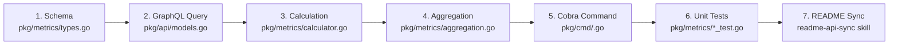

# Add Metric Subcommand Skill

This skill governs the end-to-end process of adding a new pull request metric or subcommand to `gh-pr-pro`. It enforces architectural invariants, code quality standards, table-driven test coverage, and documentation synchronization across the complete 7-stage pipeline.

## When to Use This Skill

Use this skill whenever you are tasked with:
- Adding a new metric subcommand under any metric domain (`time`, `quality`, `code`, `team`)
- Adding a new calculated field or data extraction to `ProcessedPR`
- Adding a new domain or composite report to `gh-pr-pro`
- Extending metric filtering, aggregation dimensions, or percentile calculations

---

## The 7-Stage Metric Pipeline

Every metric subcommand in `gh-pr-pro` follows an invariant 7-stage pipeline:



---

## Workflow Steps

### Step 1: Run the Metric Scaffolder & Checker

Use the built-in scaffolding utility to inspect existing metrics, verify requirements, or generate initial boilerplate code:

```bash
# Display help and usage
go run .agents/skills/add-metric/scripts/scaffold_metric.go --help

# Generate boilerplate implementation snippets for a new metric
go run .agents/skills/add-metric/scripts/scaffold_metric.go \
  --domain quality \
  --metric security \
  --desc "Security vulnerability alerts and Dependabot PR status" \
  --unit count

# Or check whether an existing metric is wired up across all 5 code locations
go run .agents/skills/add-metric/scripts/scaffold_metric.go --check ci
```

---

### Step 2: Define the Data Schema (`pkg/metrics/types.go`)

Open [`pkg/metrics/types.go`](file:///Users/brad/Projects/gh-pr-pro/pkg/metrics/types.go) and update:

1. **`ProcessedPR` struct**: Add your metric's typed field(s).
   - If duration: use `*float64` (seconds) or `float64` (seconds). Pointer is required if the value can be undefined (e.g. unmerged PRs have no TimeToMerge).
   - If count / quantity: use `int`.
   - If boolean / status: use `bool` or typed `string`.
   - Ensure JSON tags match snake_case conventions (`json:"security_alerts_count,omitempty"`).

2. **Invariants to verify**:
   - All time/duration units in `ProcessedPR` MUST be stored as `float64` seconds.
   - Use pointers (`*float64`, `*time.Time`) when an event might not have occurred (e.g. unreviewed, unmerged).

---

### Step 3: Extend GraphQL Query & Model (`pkg/api/models.go` & `client.go`)

If the metric requires additional fields from GitHub's GraphQL API:

1. In [`pkg/api/models.go`](file:///Users/brad/Projects/gh-pr-pro/pkg/api/models.go):
   - Add the corresponding Go struct fields with proper `json:"..."` tags under `GraphQLPRNode` or relevant child structs.
2. In [`pkg/api/client.go`](file:///Users/brad/Projects/gh-pr-pro/pkg/api/client.go):
   - Update `const prQuery` to request the new GraphQL field(s). Keep nested connections budgeted with explicit `(first: N)` limits (max 100).
   - Verify that adding fields does not drastically increase GraphQL node point cost.

> [!NOTE]
> If the metric can be computed from existing fields on `GraphQLPRNode` (e.g., timeline events, comments, commits, labels, reviews), skip modifying `pkg/api/`.

---

### Step 4: Implement Calculation Logic (`pkg/metrics/calculator.go`)

Open [`pkg/metrics/calculator.go`](file:///Users/brad/Projects/gh-pr-pro/pkg/metrics/calculator.go) and update [`ProcessPRNode`](file:///Users/brad/Projects/gh-pr-pro/pkg/metrics/calculator.go):

1. **Extract and compute** the metric from the raw `node api.GraphQLPRNode`.
2. **Zero-Panic Policy**: Never call `panic()` or allow nil pointer dereferences. Handle missing timestamps, empty slices, and null authors gracefully.
3. **Bot & Self-Review Filtering**: Exclude bots (`[bot]` suffix) and author self-reviews where applicable:
   ```go
   if login == "" || strings.HasSuffix(login, "[bot]") || login == node.Author.Login {
       continue
   }
   ```
4. **Assign calculated field**: Set `pr.YourNewMetric = calculatedValue`.

---

### Step 5: Update Metric Aggregation & Percentiles (`pkg/metrics/aggregation.go`)

Open [`pkg/metrics/aggregation.go`](file:///Users/brad/Projects/gh-pr-pro/pkg/metrics/aggregation.go):

1. Navigate to `computeMetricStats(prs []ProcessedPR, domain, metric string) GroupSummary`.
2. Locate `switch domain` and the nested `switch metric`. Add your `case "<metric>":`:
   ```go
   case "<metric>":
       unit = "seconds" // or "count", "percent", "lines"
       for _, pr := range prs {
           if pr.YourNewMetric != nil {
               values = append(values, *pr.YourNewMetric)
           }
       }
   ```
3. If the metric has secondary summary figures (e.g., top failing checks, breakdown by status), populate `extra["key"] = ...`.
4. The calculation engine at the end of `computeMetricStats` will automatically calculate `p50`, `p75`, `p90`, `p95`, `p99`, `mean`, `min`, and `max`.

---

### Step 6: Register the Cobra CLI Subcommand (`pkg/cmd/<domain>.go`)

Navigate to the corresponding domain file:
- `time` metrics: [`pkg/cmd/time.go`](file:///Users/brad/Projects/gh-pr-pro/pkg/cmd/time.go)
- `quality` metrics: [`pkg/cmd/quality.go`](file:///Users/brad/Projects/gh-pr-pro/pkg/cmd/quality.go)
- `code` metrics: [`pkg/cmd/code.go`](file:///Users/brad/Projects/gh-pr-pro/pkg/cmd/code.go)
- `team` metrics: [`pkg/cmd/team.go`](file:///Users/brad/Projects/gh-pr-pro/pkg/cmd/team.go)

1. Declare the subcommand:
   ```go
   var <domain><Metric>Cmd = &cobra.Command{
       Use:   "<metric>",
       Short: "Brief 1-line description",
       Long:  `Detailed multi-line explanation of the metric calculation and sources.`,
       Example: `  # Analyze <metric> over the past 30 days
     gh pr-pro <domain> <metric> --past 30d

     # Group <metric> by author
     gh pr-pro <domain> <metric> --past 90d --group-by author`,
       RunE: func(cmd *cobra.Command, args []string) error {
           return RunMetricCommand(cmd, "<domain>", "<metric>")
       },
   }
   ```
2. Register the subcommand in `init()`:
   ```go
   func init() {
       <domain>Cmd.AddCommand(<domain><Metric>Cmd)
   }
   ```

> [!WARNING]
> **Flag Scoping Invariant**: Do not bind flags directly to metric subcommands unless they are exclusively needed by that command. Domain, time, filter, and output flags are automatically bound by `RunMetricCommand`.

---

### Step 7: Write Unit & Integration Tests

1. In `pkg/metrics/calculator_test.go`:
   - Add table-driven tests with realistic mock `api.GraphQLPRNode` inputs testing:
     - Normal case
     - Edge case (nil timestamps, zero values, empty lists)
     - Bot / self-action exclusions
2. In `pkg/metrics/aggregation_test.go`:
   - Verify `computeMetricStats` returns expected `p50`, `mean`, and unit.
3. In `pkg/cmd/root_test.go`:
   - Verify command parses correctly without errors.
4. Execute tests with race detection:
   ```bash
   go test -race -v ./pkg/metrics/... ./pkg/cmd/...
   ```

---

### Step 8: Sync Documentation via `readme-api-sync` Skill

Because an API surface change was made (a new command was registered in Cobra):

1. Run the audit tool to identify required documentation changes:
   ```bash
   go run .agents/skills/readme-api-sync/scripts/audit_readme.go
   ```
2. Follow the [`readme-api-sync`](file:///Users/brad/Projects/gh-pr-pro/.agents/skills/readme-api-sync/SKILL.md) skill:
   - Add the new subcommand to the ASCII hierarchy diagram in [`README.md`](file:///Users/brad/Projects/gh-pr-pro/README.md).
   - Add a dedicated documentation section with description, copy-pasteable examples, and sample output.
   - Run `make audit-readme` until all checks pass.
