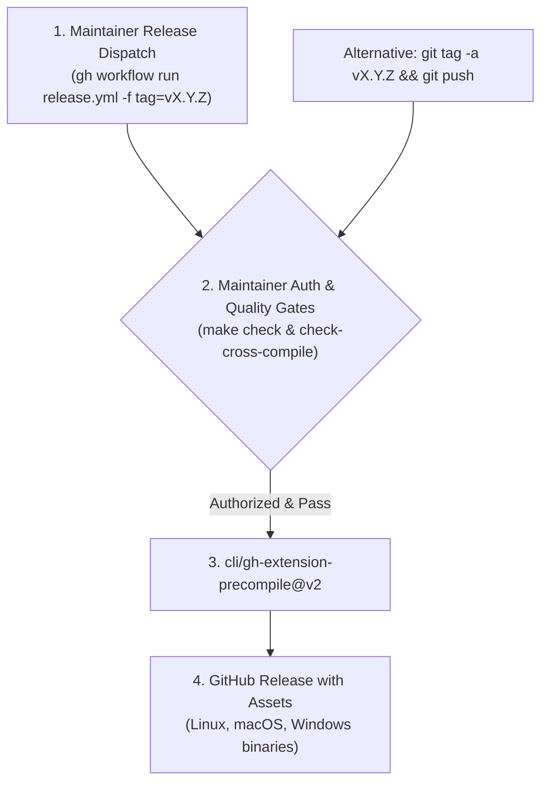

# Extension Release Preparation Skill

This skill governs the preparation, validation, and execution of new releases for the `gh-pr-pro` GitHub CLI extension.

## When to Use This Skill

Execute this skill whenever you are:
- Preparing a new version release (major, minor, or patch)
- Validating cross-compilation across supported target operating systems (`linux`, `darwin`, `windows`) and architectures (`amd64`, `arm64`)
- Generating release notes or updating changelogs
- Triggering automated releases via `gh workflow run release.yml` or creating release git tags for GitHub Actions automated distribution ([`.github/workflows/release.yml`](file:///Users/brad/Projects/gh-pr-pro/.github/workflows/release.yml))

---

## Release Architecture

`gh-pr-pro` distributes precompiled binaries through GitHub Releases using the official `cli/gh-extension-precompile` action:



---

## Workflow Steps

### Step 1: Pre-Flight Cleanliness & Branch Verification

Ensure you are on the `main` branch and have no uncommitted or untracked changes:

```bash
# Check current branch and git status
git status

# Fetch latest remote changes
git fetch origin main
git log -n 5 --oneline
```

---

### Step 2: Run Full Quality & Regression Gate

Run the repository verification suite to ensure formatting, static analysis, unit tests, README synchronization, and schema contracts pass:

```bash
# 1. Run standard pre-commit / CI gate
make check

# 2. Run output schema regression suite
./.agents/skills/schema-regression-test/scripts/verify_schemas.sh

# 3. Ensure test suite passes with race detection
go test -race -count=1 ./...
```

---

### Step 3: Validate Cross-Platform Compilation

`gh-pr-pro` supports 5 OS/architecture targets matching [`.github/workflows/ci.yml`](file:///Users/brad/Projects/gh-pr-pro/.github/workflows/ci.yml):
1. `linux/amd64`
2. `linux/arm64`
3. `darwin/amd64`
4. `darwin/arm64`
5. `windows/amd64`

Run the built-in cross-compilation validation script:

```bash
./.agents/skills/release-prep/scripts/verify_cross_compile.sh
```

This ensures there are no OS-specific syscalls, incompatible filepath separators, or architecture-specific build failures.

---

### Step 4: Determine Version & Generate Release Notes

Follow Semantic Versioning (`vMAJOR.MINOR.PATCH`):
- **PATCH** (`v0.1.1`): Bug fixes, documentation updates, performance improvements.
- **MINOR** (`v0.2.0`): New metric commands, new CLI flags, new export formats.
- **MAJOR** (`v1.0.0`): Breaking CLI API changes, output schema alterations.

Generate release notes from conventional commit messages since the last release tag:

```bash
# Generate release notes
./.agents/skills/release-prep/scripts/generate_release_notes.sh
```

---

### Step 5: Smoke Test Local Extension Installation

Test installing the extension locally to verify metadata and CLI execution:

```bash
# Install extension from current working directory
gh extension install .

# Verify extension is listed
gh extension list | grep gh-pr-pro

# Verify binary executes
gh pr-pro --help

# Remove local development symlink when done testing
gh extension remove pr-pro
```

---

### Step 6: Trigger Release

#### Option A: Automated Dispatch (Recommended for Maintainers)

Maintainers can trigger the automated release pipeline via GitHub CLI or the GitHub web UI:

```bash
# Trigger automated release for target tag
gh workflow run release.yml -f tag=vX.Y.Z

# Optional: Dry-run mode (runs verification and compilation without creating a release)
gh workflow run release.yml -f tag=vX.Y.Z -f dry_run=true
```

The workflow will:
1. Validate that the invoking user has maintainer (`admin` or `write`) permissions via GitHub Collaborator API.
2. Run all quality, schema, and cross-compilation gates in CI.
3. Call `cli/gh-extension-precompile@v2` to compile binaries for Linux, macOS, and Windows, tag the release, and upload release assets.

#### Option B: Manual Tag Push

Alternatively, create and push an annotated git tag:

```bash
# Create annotated tag
git tag -a vX.Y.Z -m "Release vX.Y.Z"

# Push tag to trigger .github/workflows/release.yml
git push origin vX.Y.Z
```

Monitor the release workflow in GitHub Actions until assets are precompiled and attached to the GitHub Release.
